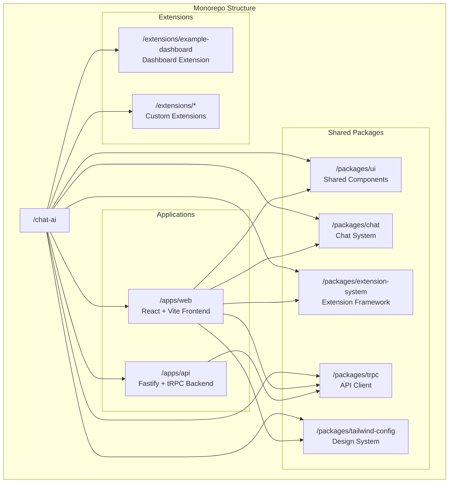

# ADR-001: Monorepo Architecture with Turborepo

**Status**: Accepted  
**Date**: 2025-01-17  
**Deciders**: Architecture Team  

## Context

The Chat AI project is a complex full-stack application that includes multiple applications (web frontend, API backend), shared packages (UI components, chat system, extension system), and extensible architecture through plugins. We needed to decide on the project structure and build system.

## Decision

We decided to implement a **monorepo architecture using Turborepo** with npm workspaces for package management.

### Architecture Overview



### Build System Configuration

- **Turborepo**: Manages build orchestration, caching, and parallelization
- **npm workspaces**: Handles dependency management and linking
- **TypeScript project references**: Enables incremental builds and proper type checking

### Workspace Structure

```
chat-ai/
├── package.json           # Root package with workspaces
├── turbo.json            # Turborepo configuration
├── tsconfig.json         # Root TypeScript config
├── apps/                 # Applications
│   ├── web/             # React frontend
│   └── api/             # Node.js backend
├── packages/            # Shared packages
│   ├── ui/              # React component library
│   ├── chat/            # Chat system core
│   ├── extension-system/ # Extension framework
│   ├── trpc/            # tRPC client/server setup
│   └── tailwind-config/ # Design system
└── extensions/          # Extension modules
    └── example-dashboard/
```

## Consequences

### Positive

1. **Shared Code Reuse**: Common functionality is packaged and reused across applications
2. **Type Safety**: Shared TypeScript types ensure consistency across the stack
3. **Build Optimization**: Turborepo provides intelligent caching and parallel builds
4. **Dependency Management**: Simplified dependency management with workspace linking
5. **Development Experience**: Hot reloading and fast feedback loops
6. **Extensibility**: Clear structure for adding new applications and packages

### Negative

1. **Complexity**: Higher initial setup complexity compared to separate repositories
2. **Build Dependencies**: Changes in shared packages trigger rebuilds of dependent applications
3. **Repository Size**: Single repository grows larger over time
4. **Tool Configuration**: Requires careful configuration of development tools

## Alternatives Considered

### Multi-Repository Architecture
- **Pros**: Complete separation, independent versioning, smaller repositories
- **Cons**: Code duplication, complex dependency management, versioning overhead
- **Decision**: Rejected due to code sharing requirements and development overhead

### Lerna + Yarn Workspaces
- **Pros**: Mature ecosystem, good npm support
- **Cons**: Less optimized builds, more configuration required
- **Decision**: Rejected in favor of Turborepo's superior build performance

### Rush.js
- **Pros**: Enterprise-focused, powerful publishing workflows
- **Cons**: Steeper learning curve, overcomplicated for current needs
- **Decision**: Rejected due to complexity for project scale

## Implementation Details

### Package Dependencies

```json
{
  "workspaces": [
    "apps/*",
    "packages/*", 
    "extensions/*"
  ]
}
```

### Turborepo Tasks

- `build`: Builds all packages with proper dependency order
- `dev`: Runs development servers with hot reloading
- `lint`: Runs linting across all packages
- `test`: Executes test suites with dependency awareness

### TypeScript Configuration

Root `tsconfig.json` uses project references to enable incremental compilation:

```json
{
  "references": [
    { "path": "./apps/web" },
    { "path": "./packages/ui" },
    { "path": "./packages/chat" }
  ]
}
```