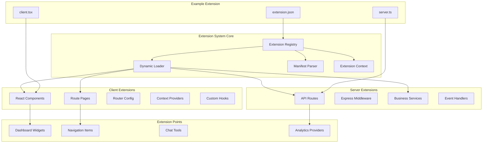
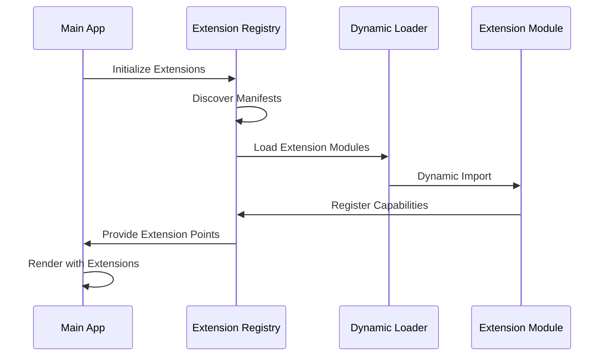

# ADR-002: Extension System Architecture

**Status**: Accepted  
**Date**: 2025-01-17  
**Deciders**: Architecture Team  

## Context

The Chat AI application needs to be highly extensible to support different use cases, integrations, and customizations. We needed a robust extension system that allows third-party developers to extend functionality without modifying core code.

## Decision

We decided to implement a **comprehensive extension system** that supports both client-side and server-side extensions with a plugin architecture.

### Extension System Architecture



### Extension Manifest Structure

Each extension defines its capabilities through a JSON manifest:

```json
{
  "id": "dashboard-example",
  "name": "Dashboard Example Extension",
  "version": "1.0.0",
  "capabilities": {
    "client": {
      "components": ["dashboard-widget", "stats-card"],
      "pages": ["dashboard-page"],
      "routes": ["dashboard-routes"],
      "providers": ["dashboard-provider"]
    },
    "server": {
      "routes": ["dashboard-api"],
      "services": ["analytics-service"]
    }
  },
  "extensionPoints": [
    {
      "id": "dashboard-widget",
      "name": "Dashboard Widget",
      "type": "component"
    }
  ]
}
```

### Extension Loading Flow



## Consequences

### Positive

1. **Modularity**: Core application remains focused, extensions add specific functionality
2. **Third-Party Development**: External developers can extend the application
3. **Runtime Loading**: Extensions can be loaded dynamically without rebuilding
4. **Type Safety**: TypeScript support for extension development
5. **Isolation**: Extensions are sandboxed and don't interfere with each other
6. **Hot Reloading**: Development mode supports hot reloading of extensions

### Negative

1. **Complexity**: Adds architectural complexity to the core system
2. **Performance**: Dynamic loading can impact initial application startup
3. **Security**: Need to ensure extensions can't compromise the application
4. **Debugging**: More complex debugging when issues span core + extensions

## Implementation Details

### Extension Registry

The core `ExtensionRegistry` class manages extension lifecycle:

```typescript
class ExtensionRegistry {
  async registerExtension(manifest: ExtensionManifest, loader: () => Promise<any>)
  async loadExtension(extensionId: string)
  async unregisterExtension(extensionId: string)
  getExtension(extensionId: string): Extension
  getAllExtensions(): Extension[]
  getExtensionsByCapability(capability: string): Extension[]
}
```

### Client-Side Integration

React components use the `ClientExtensionProvider` to access extensions:

```typescript
function useClientExtensions() {
  const { getComponents, getRoutes, getProviders } = useContext(ClientExtensionContext)
  
  // Get components for a specific extension point
  const widgets = getComponents('dashboard-widget')
  
  // Get all routes from extensions
  const routes = getRoutes()
  
  return { widgets, routes }
}
```

### Extension Structure

```
extensions/example-dashboard/
├── extension.json       # Extension manifest
├── package.json        # Dependencies
├── src/
│   ├── client.tsx      # Client-side exports
│   ├── server.ts       # Server-side exports
│   ├── components/     # React components
│   ├── pages/          # Route pages
│   └── routes/         # Route definitions
└── dist/               # Built extension
```

### Security Considerations

1. **Manifest Validation**: All manifests are validated against a schema
2. **Permission System**: Extensions declare required permissions
3. **Sandboxing**: Extensions run in isolated contexts
4. **Code Review**: Extension marketplace requires code review

### Extension Points

The system defines several built-in extension points:

- **dashboard-widget**: Dashboard components
- **sidebar-navigation**: Navigation menu items
- **chat-tool**: Chat tools and integrations
- **theme-provider**: Custom themes
- **analytics-provider**: Data analytics sources

## Alternatives Considered

### Micro-Frontend Architecture

- **Pros**: Complete isolation, independent deployment
- **Cons**: Complex communication, larger bundle sizes
- **Decision**: Rejected due to communication complexity

### Plugin System (Webpack Federation)

- **Pros**: Module federation, runtime loading
- **Cons**: Complex setup, limited to frontend
- **Decision**: Rejected due to full-stack requirements

### Simple Configuration-Based Extensions

- **Pros**: Simpler implementation, configuration-driven
- **Cons**: Limited extensibility, no custom code
- **Decision**: Rejected due to flexibility requirements

## Future Considerations

1. **Extension Marketplace**: Build a marketplace for sharing extensions
2. **Versioning**: Implement extension versioning and compatibility checks
3. **Performance Optimization**: Lazy loading and code splitting
4. **Developer Tools**: Build developer tools for extension development
5. **Security Enhancements**: Implement stricter sandboxing and permission systems