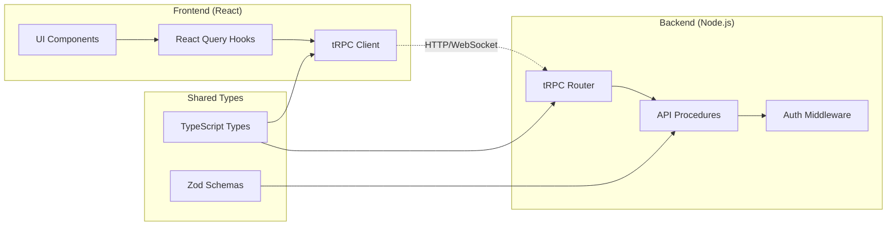
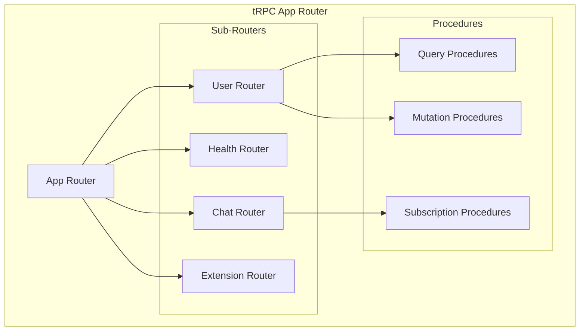

# ADR-003: Full-Stack Type Safety with tRPC

**Status**: Accepted  
**Date**: 2025-01-17  
**Deciders**: Architecture Team  

## Context

The Chat AI application requires strong communication between the frontend and backend with type safety, real-time capabilities, and a good developer experience. We needed to choose an API architecture that provides end-to-end type safety while supporting complex data flows.

## Decision

We decided to implement **tRPC (TypeScript Remote Procedure Call)** for full-stack type safety between the React frontend and Node.js backend.

### tRPC Architecture



### API Structure



## Implementation Details

### Backend Router Configuration

```typescript
// apps/api/src/router.ts
import { healthRouter } from "./routers/health";
import { userRouter } from "./routers/user";
import { router } from "./trpc";

export const appRouter = router({
  user: userRouter,
  health: healthRouter,
});

export type AppRouter = typeof appRouter;
```

### Frontend Client Setup

```typescript
// packages/trpc/src/client.ts
import { createTRPCReact } from '@trpc/react-query';
import type { AppRouter } from '@chat-ai/api';

export const trpc = createTRPCReact<AppRouter>();
```

### React Integration

```typescript
// Component usage
function UserProfile() {
  const { data: user, isLoading } = trpc.user.getProfile.useQuery();
  const updateUser = trpc.user.update.useMutation();
  
  if (isLoading) return <div>Loading...</div>;
  
  return (
    <div>
      <h1>{user?.name}</h1>
      <button onClick={() => updateUser.mutate({ name: 'New Name' })}>
        Update
      </button>
    </div>
  );
}
```

### Type Safety Benefits

1. **End-to-End Types**: Frontend automatically gets types from backend
2. **Runtime Validation**: Zod schemas validate data at runtime
3. **Autocomplete**: Full IntelliSense support in the frontend
4. **Refactoring Safety**: Changes to API break frontend compilation

## Consequences

### Positive

1. **Type Safety**: Compile-time guarantees for API contracts
2. **Developer Experience**: Excellent autocomplete and error detection
3. **Performance**: Optimized queries with React Query integration
4. **Real-time**: Built-in WebSocket support for subscriptions
5. **Validation**: Automatic request/response validation with Zod
6. **Caching**: Smart caching with React Query

### Negative

1. **Learning Curve**: Developers need to learn tRPC concepts
2. **Bundle Size**: Additional runtime overhead compared to REST
3. **Ecosystem**: Smaller ecosystem compared to REST/GraphQL
4. **Debugging**: Network debugging requires tRPC-specific tools

## Technical Implementation

### Server Setup (Fastify)

```typescript
// apps/api/src/index.ts
import { fastifyTRPCPlugin } from "@trpc/server/adapters/fastify";
import Fastify from "fastify";
import { appRouter } from "./router";

const server = Fastify();

void server.register(fastifyTRPCPlugin, {
  prefix: "/trpc",
  trpcOptions: { router: appRouter },
});
```

### Client Provider

```typescript
// packages/trpc/src/provider.tsx
import { QueryClient, QueryClientProvider } from '@tanstack/react-query';
import { trpc } from './client';

const queryClient = new QueryClient();
const trpcClient = trpc.createClient({
  url: 'http://localhost:3001/trpc',
});

export function TRPCProvider({ children }: { children: React.ReactNode }) {
  return (
    <trpc.Provider client={trpcClient} queryClient={queryClient}>
      <QueryClientProvider client={queryClient}>
        {children}
      </QueryClientProvider>
    </trpc.Provider>
  );
}
```

### Procedure Types

```typescript
// Query Procedure
export const getUser = publicProcedure
  .input(z.object({ id: z.string() }))
  .query(async ({ input }) => {
    return await getUserById(input.id);
  });

// Mutation Procedure  
export const updateUser = publicProcedure
  .input(z.object({ id: z.string(), name: z.string() }))
  .mutation(async ({ input }) => {
    return await updateUserById(input.id, { name: input.name });
  });

// Subscription Procedure
export const onUserUpdate = publicProcedure
  .subscription(() => {
    return observable<User>((emit) => {
      // WebSocket logic
    });
  });
```

## Alternatives Considered

### REST API with OpenAPI

- **Pros**: Industry standard, great tooling, widespread adoption
- **Cons**: Manual type sync, no compile-time safety
- **Decision**: Rejected due to lack of type safety

### GraphQL

- **Pros**: Flexible queries, strong typing, mature ecosystem
- **Cons**: Complex setup, over-fetching solutions, learning curve
- **Decision**: Rejected due to complexity for current needs

### Server Actions (Next.js)

- **Pros**: Simple setup, built-in to Next.js
- **Cons**: Tied to Next.js, limited to form submissions
- **Decision**: Not applicable (using Vite + React)

## Future Considerations

1. **Real-time Features**: Implement WebSocket subscriptions for chat
2. **Caching Strategy**: Advanced caching with Redis
3. **Rate Limiting**: Implement procedure-level rate limiting
4. **Error Handling**: Standardized error handling across procedures
5. **Testing**: Integration testing for tRPC procedures