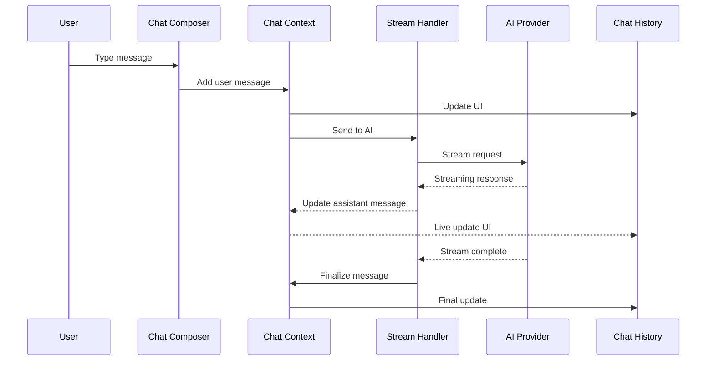

# ADR-004: Chat System Architecture

**Status**: Accepted  
**Date**: 2025-01-17  
**Deciders**: Architecture Team  

## Context

The core functionality of the Chat AI application is an intelligent chat system that supports streaming responses, message history, and extensible message parts. We needed to design a robust, scalable chat architecture that supports real-time interactions and various message types.

## Decision

We decided to implement a **comprehensive chat system** using React Context for state management, streaming responses with the Vercel AI SDK, and a modular message part system.

### Chat System Architecture

```mermaid
graph TB
    subgraph "Chat Context Layer"
        ChatContext[Chat Context]
        MessageContext[Message Context]
        PromptContext[Prompt Context]
        AssistantContext[Assistant Message Context]
        UserContext[User Message Context]
    end
    
    subgraph "Chat UI Components"
        ChatRoot[Chat Root]
        ChatLayout[Chat Layout]
        ChatHistory[Chat History]
        ChatComposer[Chat Composer]
        ChatLanding[Chat Landing]
    end
    
    subgraph "Message System"
        MessageParts[Message Parts]
        TextPart[Text Part]
        MarkdownPart[Markdown Part]
        CodePart[Code Part]
        ToolPart[Tool Part]
    end
    
    subgraph "Chat Providers"
        ChatProvider[Chat Provider]
        MessageProvider[Message Provider]
        StreamProvider[Stream Provider]
    end
    
    subgraph "External Integrations"
        AI[AI Provider (Ollama)]
        Stream[Streaming API]
        Tools[Chat Tools]
    end
    
    ChatContext --> ChatProvider
    ChatProvider --> ChatRoot
    ChatRoot --> ChatLayout
    ChatLayout --> ChatHistory
    ChatLayout --> ChatComposer
    
    ChatHistory --> MessageParts
    MessageParts --> TextPart
    MessageParts --> MarkdownPart
    MessageParts --> CodePart
    
    ChatComposer --> Stream
    Stream --> AI
    ChatProvider --> Tools
```

### Message Flow Architecture



## Implementation Details

### Chat Context Structure

```typescript
interface ChatState {
  messages: Message[];
  isStreaming: boolean;
  currentAssistantMessage?: Message;
  error?: string;
  tools: Tool[];
}

interface ChatActions {
  sendMessage: (content: string) => Promise<void>;
  addMessage: (message: Message) => void;
  updateMessage: (id: string, updates: Partial<Message>) => void;
  clearHistory: () => void;
  setTools: (tools: Tool[]) => void;
}
```

### Message Part System

The chat system supports various message parts for rich content:

```typescript
interface MessagePart {
  id: string;
  type: 'text' | 'markdown' | 'code' | 'tool' | 'image';
  content: string;
  metadata?: Record<string, any>;
}

interface Message {
  id: string;
  role: 'user' | 'assistant' | 'system';
  parts: MessagePart[];
  timestamp: Date;
  status: 'pending' | 'complete' | 'error';
}
```

### Streaming Implementation

```typescript
// Stream text with real-time updates
export async function streamText(
  prompt: string,
  onChunk: (chunk: string) => void,
  onComplete: (fullText: string) => void
) {
  const response = await fetch('/api/chat', {
    method: 'POST',
    body: JSON.stringify({ prompt }),
    headers: { 'Content-Type': 'application/json' }
  });

  const reader = response.body?.getReader();
  let fullText = '';

  while (true) {
    const { done, value } = await reader.read();
    if (done) break;
    
    const chunk = new TextDecoder().decode(value);
    fullText += chunk;
    onChunk(chunk);
  }
  
  onComplete(fullText);
}
```

### Chat Reducer Pattern

```typescript
interface ChatAction {
  type: 'ADD_MESSAGE' | 'UPDATE_MESSAGE' | 'SET_STREAMING' | 'SET_ERROR';
  payload: any;
}

function chatReducer(state: ChatState, action: ChatAction): ChatState {
  switch (action.type) {
    case 'ADD_MESSAGE':
      return {
        ...state,
        messages: [...state.messages, action.payload]
      };
    
    case 'UPDATE_MESSAGE':
      return {
        ...state,
        messages: state.messages.map(msg =>
          msg.id === action.payload.id
            ? { ...msg, ...action.payload.updates }
            : msg
        )
      };
    
    case 'SET_STREAMING':
      return {
        ...state,
        isStreaming: action.payload
      };
    
    default:
      return state;
  }
}
```

## Consequences

### Positive

1. **Real-time Experience**: Streaming responses provide immediate feedback
2. **Modular Messages**: Message parts system supports rich content
3. **State Management**: React Context provides predictable state updates
4. **Extensibility**: Easy to add new message types and tools
5. **Performance**: Optimized rendering with proper React patterns
6. **Type Safety**: Full TypeScript support for all chat operations

### Negative

1. **Memory Usage**: Long conversations can consume significant memory
2. **Context Complexity**: Multiple nested contexts can be confusing
3. **Stream Handling**: Complex error handling for streaming responses
4. **State Synchronization**: Ensuring UI stays in sync with streaming data

## Chat Components Architecture

### Layout Structure

```typescript
// Chat Layout Hierarchy
<ChatRoot>
  <ChatProvider>
    <ChatLayout>
      <ChatAside>           // Sidebar with history/tools
        <ChatNavigation />
        <ToolPanel />
      </ChatAside>
      
      <ChatMain>            // Main chat area
        <ChatHistory>       // Message history
          <MessagePart />
        </ChatHistory>
        
        <ChatComposer>      // Input area
          <MessageInput />
          <ActionButtons />
        </ChatComposer>
      </ChatMain>
    </ChatLayout>
  </ChatProvider>
</ChatRoot>
```

### Message Part Rendering

```typescript
function MessagePart({ part }: { part: MessagePart }) {
  switch (part.type) {
    case 'text':
      return <ChatMessageTextPart content={part.content} />;
    
    case 'markdown':
      return <ChatMessageMarkdownPart content={part.content} />;
    
    case 'code':
      return <CodeBlock language={part.metadata?.language} code={part.content} />;
    
    case 'tool':
      return <ToolResult result={part.content} metadata={part.metadata} />;
    
    default:
      return <div>Unknown message part type</div>;
  }
}
```

## Integration with AI Providers

The chat system supports multiple AI providers through a unified interface:

```typescript
interface AIProvider {
  name: string;
  streamChat: (messages: Message[]) => AsyncIterable<string>;
  supports: {
    streaming: boolean;
    tools: boolean;
    images: boolean;
  };
}

// Ollama Provider Implementation
const ollamaProvider: AIProvider = {
  name: 'ollama',
  streamChat: async function* (messages) {
    // Implementation for Ollama streaming
  },
  supports: {
    streaming: true,
    tools: true,
    images: false
  }
};
```

## Alternatives Considered

### Redux/Zustand for State Management

- **Pros**: Centralized state, time travel debugging
- **Cons**: Overhead for simple chat state, complex setup
- **Decision**: Rejected in favor of React Context for simplicity

### Socket.io for Real-time Communication

- **Pros**: Real-time bidirectional communication
- **Cons**: Server complexity, not needed for AI streaming
- **Decision**: Rejected in favor of HTTP streaming

### Separate Message Storage Service

- **Pros**: Persistent chat history, scalability
- **Cons**: Additional complexity, current scope doesn't require it
- **Decision**: Deferred for future implementation

## Future Enhancements

1. **Message Persistence**: Store chat history in database
2. **Multi-session Support**: Support multiple concurrent chat sessions
3. **Advanced Tools**: Integration with external APIs and services
4. **Message Search**: Full-text search across chat history
5. **Export/Import**: Chat history export and import functionality
6. **Collaborative Chat**: Multi-user chat sessions