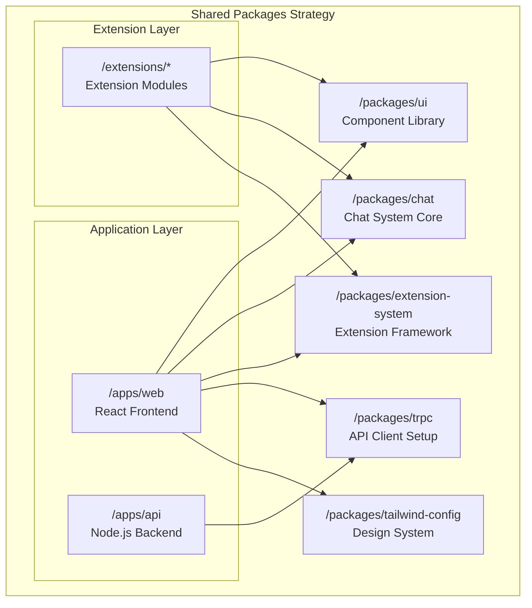
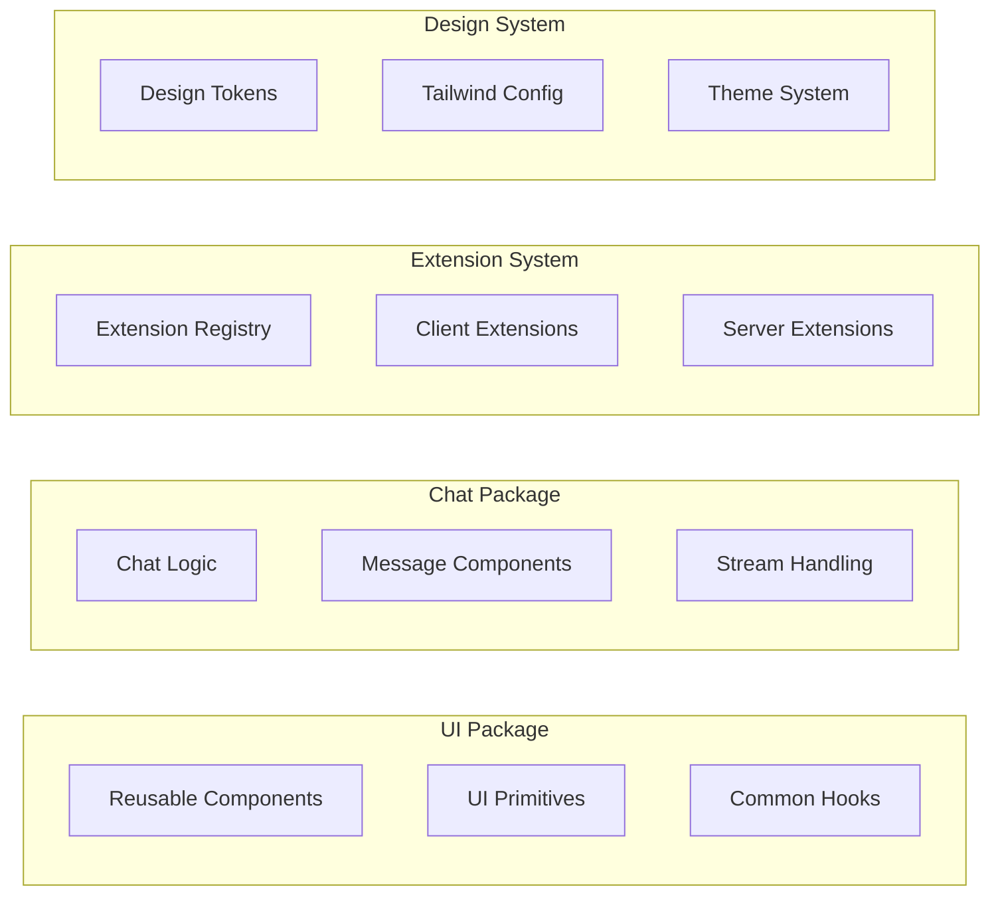
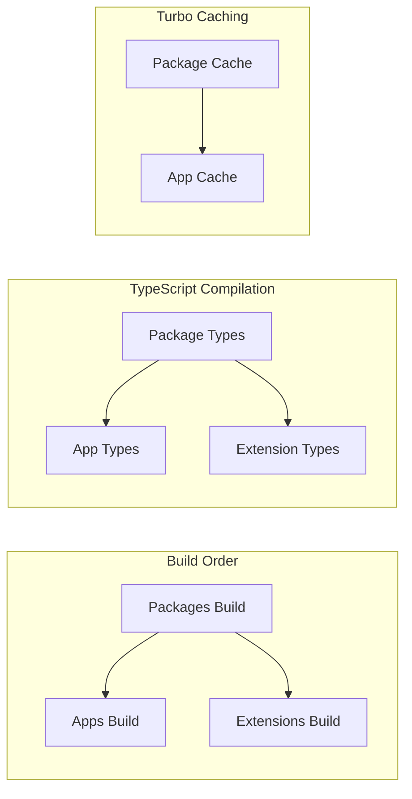

# ADR-005: Package Management Strategy

**Status**: Accepted  
**Date**: 2025-01-17  
**Deciders**: Architecture Team  

## Context

The Chat AI monorepo contains multiple applications and shared packages that need efficient dependency management, consistent styling, and reusable components. We needed a strategy for organizing shared code and managing dependencies across the workspace.

## Decision

We decided to implement a **package-based architecture** with specialized shared packages for different concerns: UI components, styling, chat functionality, tRPC setup, and extension system.

### Package Architecture



### Package Responsibilities



## Implementation Details

### Package Structure and Exports

#### @chat-ai/ui Package

```typescript
// packages/ui/src/index.ts
export * from './ui/button';
export * from './ui/input';
export * from './ui/card';
export * from './ui/dialog';
export * from './ui/accordion';
// ... other UI components

export * from './hooks/use-mobile';
export * from './lib/cn';
```

**Purpose**: Provides reusable UI components based on shadcn/ui with consistent styling and behavior.

**Key Components**:

- Form controls (Button, Input, Select, etc.)
- Layout components (Card, Dialog, Sheet, etc.)
- Navigation components (Accordion, Tabs, etc.)
- Utility hooks and functions

#### @chat-ai/chat Package

```typescript
// packages/chat/src/index.ts
export * from './context/chat-context';
export * from './ui/chat-root';
export * from './ui/chat-layout';
export * from './ui/chat-composer';
export * from './ui/chat-history';
export * from './models/message';
export * from './lib/stream-text';
```

**Purpose**: Contains all chat-related functionality including UI components, context providers, and business logic.

**Key Features**:

- Chat context and state management
- Message rendering and streaming
- Chat UI components
- Message part system

#### @chat-ai/extension-system Package

```typescript
// packages/extension-system/src/index.ts
export * from './core/registry';
export * from './core/types';
export * as Client from './client';
export * as Server from './server';
```

**Purpose**: Provides the extension framework for building modular, extensible applications.

**Key Features**:

- Extension registry and lifecycle management
- Client-side extension points
- Server-side extension points
- Type definitions for extensions

#### @chat-ai/trpc Package

```typescript
// packages/trpc/src/index.ts
export * from './client';
export * from './provider';
export * from './config';
```

**Purpose**: Centralizes tRPC client configuration and React integration.

**Key Features**:

- tRPC client setup
- React Query integration
- Provider components for apps

#### @chat-ai/tailwind-config Package

```javascript
// packages/tailwind-config/index.js
module.exports = {
  content: [],
  theme: {
    extend: {
      colors: {
        border: "hsl(var(--border))",
        background: "hsl(var(--background))",
        // ... design tokens
      }
    }
  },
  plugins: []
}
```

**Purpose**: Provides consistent Tailwind CSS configuration and design tokens across all applications.

**Key Features**:

- Shared design tokens
- Custom component styles
- CSS utilities and plugins

### Dependency Management Strategy

#### Package.json Configuration

Each package defines its dependencies clearly:

```json
{
  "name": "@chat-ai/ui",
  "dependencies": {
    "react": "^19.1.1",
    "react-dom": "^19.1.1",
    "@tailwindcss/vite": "^4.1.13"
  },
  "peerDependencies": {
    "react": ">=18.0.0",
    "react-dom": ">=18.0.0"
  }
}
```

#### Workspace Dependencies

Applications reference packages using workspace protocol:

```json
{
  "dependencies": {
    "@chat-ai/ui": "file:../../packages/ui",
    "@chat-ai/chat": "file:../../packages/chat",
    "@chat-ai/extension-system": "file:../../packages/extension-system"
  }
}
```

### Build Pipeline



Turborepo ensures packages are built before applications:

```json
{
  "tasks": {
    "build": {
      "dependsOn": ["^build"],
      "outputs": ["dist/**"]
    }
  }
}
```

## Consequences

### Positive

1. **Code Reuse**: Shared functionality is packaged and reused across applications
2. **Type Safety**: Packages export TypeScript types for compile-time safety
3. **Independent Versioning**: Each package can evolve independently
4. **Clear Boundaries**: Separation of concerns between different functionality
5. **Testability**: Packages can be tested in isolation
6. **Bundle Optimization**: Tree-shaking eliminates unused code

### Negative

1. **Build Complexity**: Dependencies between packages require careful build ordering
2. **Circular Dependencies**: Risk of circular dependencies between packages
3. **Versioning Overhead**: Managing compatibility between package versions
4. **Setup Complexity**: Initial setup requires understanding package relationships

## Package Design Principles

### Single Responsibility

Each package has a clear, focused responsibility:

- **UI**: Visual components and design system
- **Chat**: Chat functionality and components
- **Extension System**: Extension framework
- **tRPC**: API communication setup
- **Tailwind Config**: Styling configuration

### API Design

Packages expose clean, documented APIs:

```typescript
// Good: Clear, focused export
export { ChatProvider, useChatContext } from './context';

// Bad: Internal implementation details
export { chatReducer, ChatActionTypes } from './internal';
```

### Dependency Direction

Dependencies flow inward from applications to packages:

```text
Apps --> Packages (✓ Allowed)
Packages --> Apps (✗ Not allowed)
Packages --> Other Packages (⚠️ Carefully managed)
```

### Extension Points

Packages provide extension points for customization:

```typescript
// UI Package provides theme extension points
export interface ThemeConfig {
  colors: Record<string, string>;
  spacing: Record<string, string>;
  // Extensible theme configuration
}
```

## Development Workflow

### Package Development

1. **Local Development**: Use `npm run dev` to start package in watch mode
2. **Testing**: Run `npm test` in package directory for isolated testing
3. **Building**: Packages build automatically when dependencies change
4. **Publishing**: Future consideration for npm registry publishing

### Cross-Package Changes

1. **Breaking Changes**: Coordinate changes across dependent applications
2. **Version Bumping**: Update package versions when APIs change
3. **Migration Guides**: Document breaking changes and migration paths

## Alternatives Considered

### Monolithic Shared Library

- **Pros**: Simple setup, everything in one place
- **Cons**: Large bundle size, unclear boundaries
- **Decision**: Rejected in favor of focused packages

### External Package Registry

- **Pros**: Proper versioning, independent deployment
- **Cons**: Overhead for internal packages, complex CI/CD
- **Decision**: Deferred until packages are stable

### Copy-Paste Sharing

- **Pros**: No dependency management, simple
- **Cons**: Code duplication, maintenance burden
- **Decision**: Rejected due to maintenance issues

## Future Considerations

1. **Package Registry**: Publish packages to npm for external use
2. **Semantic Versioning**: Implement proper versioning strategy
3. **Package Documentation**: Generate API documentation for packages
4. **Performance Monitoring**: Track bundle sizes and performance impact
5. **Plugin Architecture**: Allow packages to extend each other through plugins