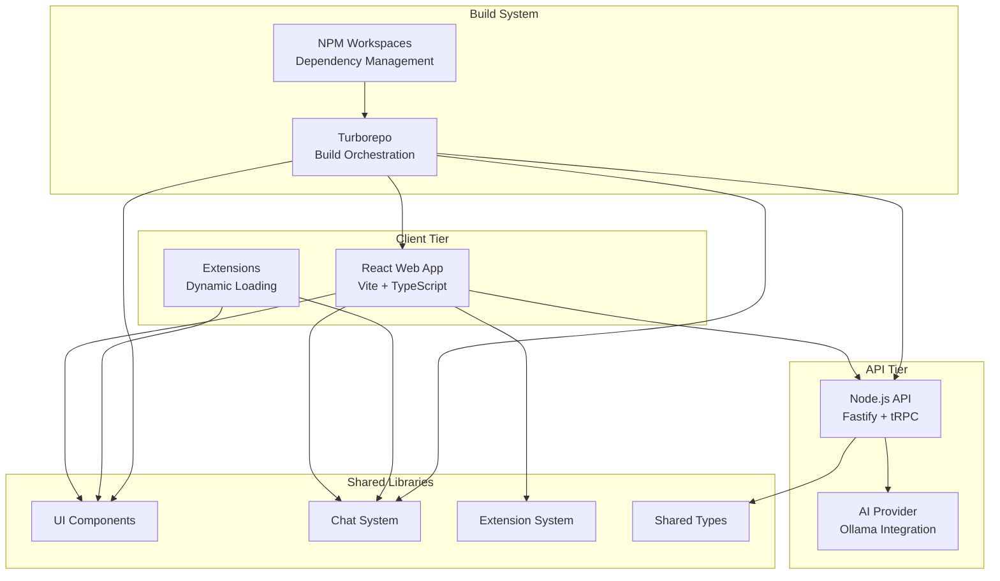
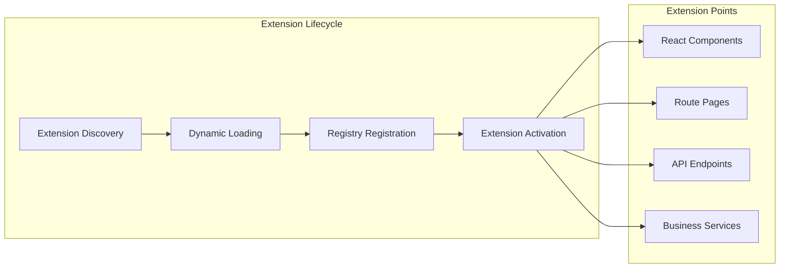
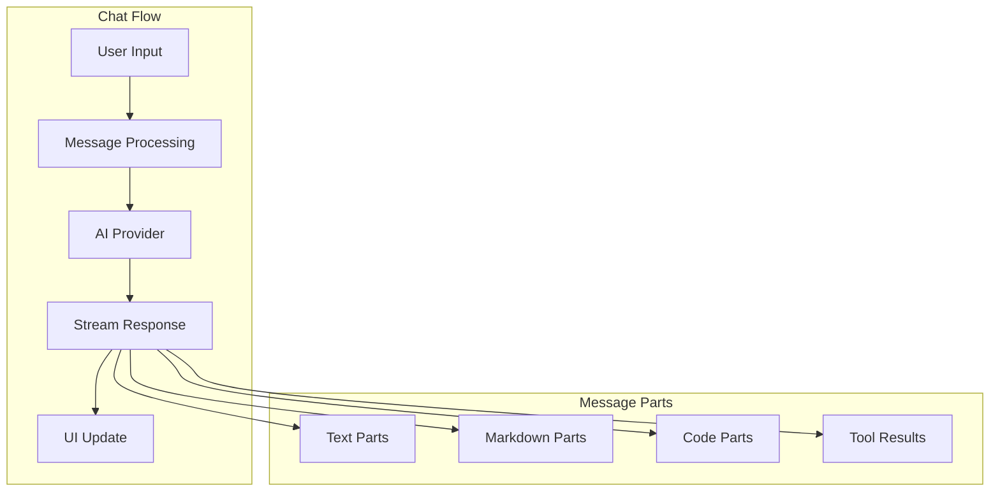
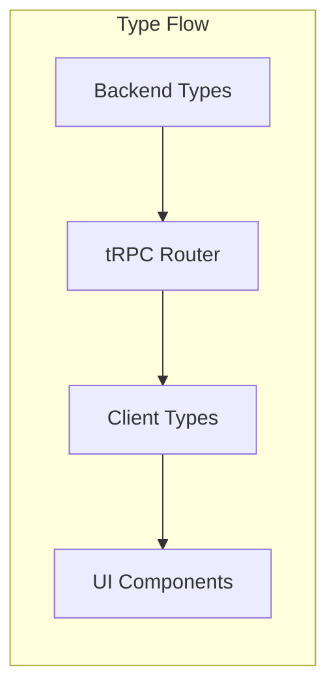
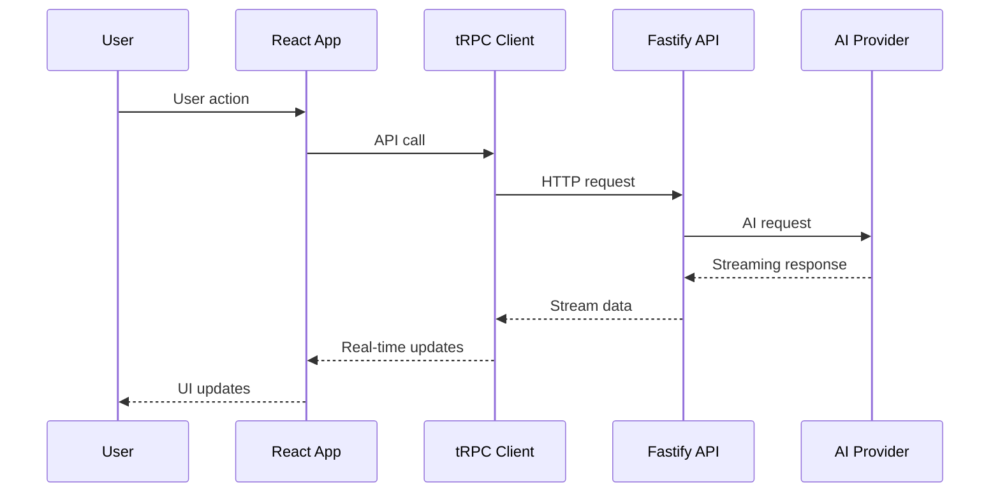
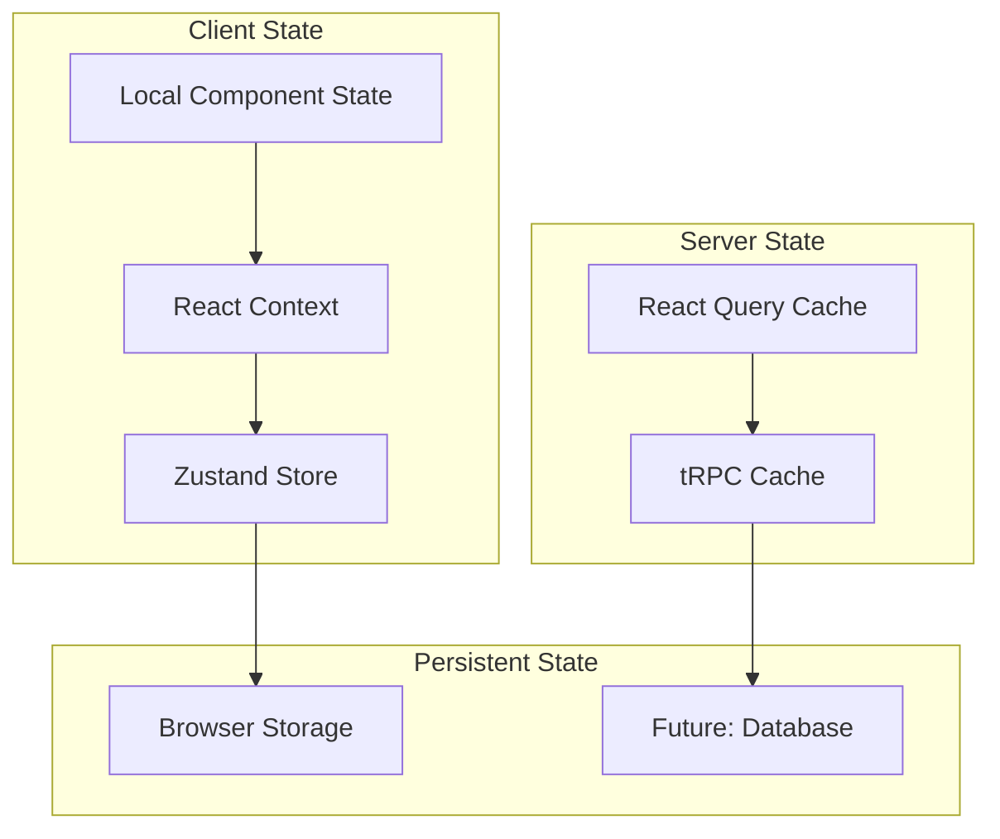
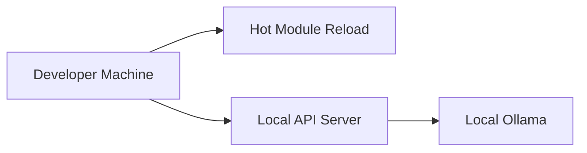
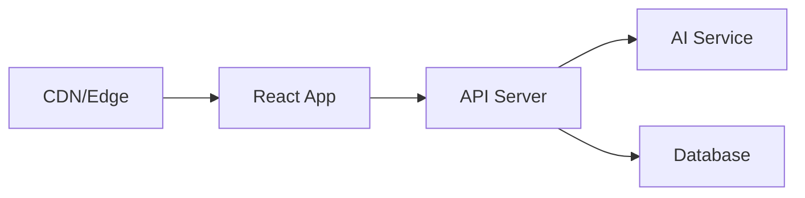

# Chat AI - System Architecture Overview

**Last Updated**: January 17, 2025  
**Version**: 1.0  

## Executive Summary

Chat AI is a modern, extensible chat application built with a monorepo architecture that supports full-stack type safety, real-time streaming, and a comprehensive extension system. The project is designed to be highly modular, allowing for easy customization and third-party extensions.

## High-Level System Architecture



## Technology Stack

### Frontend Stack

- **React 19**: UI framework with concurrent features
- **TypeScript**: Type safety and developer experience
- **Vite**: Fast build tool and development server
- **Tailwind CSS**: Utility-first CSS framework
- **React Router**: Client-side routing
- **React Query**: Server state management
- **Zustand**: Client state management

### Backend Stack

- **Node.js**: JavaScript runtime
- **Fastify**: High-performance web framework
- **tRPC**: Type-safe API communication
- **TypeScript**: Full-stack type safety
- **Zod**: Runtime type validation

### Build & Development

- **Turborepo**: Monorepo build system
- **npm Workspaces**: Package management
- **ESLint**: Code linting
- **Vitest**: Testing framework

### AI Integration

- **Ollama**: Local AI model hosting
- **Vercel AI SDK**: Streaming AI responses
- **Custom Providers**: Extensible AI provider system

## Core System Components

### 1. Monorepo Structure

The project uses a monorepo architecture with clearly defined boundaries:

```text
chat-ai/
├── apps/                 # Applications
│   ├── web/             # React frontend
│   └── api/             # Node.js backend
├── packages/            # Shared libraries
│   ├── ui/              # Component library
│   ├── chat/            # Chat system
│   ├── extension-system/ # Extension framework
│   ├── trpc/            # API client setup
│   └── tailwind-config/ # Design system
└── extensions/          # Extension modules
    └── example-dashboard/
```

### 2. Extension System

The extension system allows for modular functionality through a plugin architecture:



### 3. Chat System

The chat system provides real-time conversational AI with streaming responses:



### 4. Type Safety

Full-stack type safety is achieved through tRPC and shared TypeScript types:



## Data Flow Architecture

### Request/Response Flow



### State Management



## Security Considerations

### Extension Security

- **Manifest Validation**: All extension manifests are validated
- **Permission System**: Extensions declare required permissions
- **Sandboxing**: Extensions run in isolated contexts
- **Code Review**: Future marketplace will require code review

### API Security

- **Type Validation**: All inputs validated with Zod schemas
- **CORS Configuration**: Properly configured cross-origin requests
- **Rate Limiting**: Future implementation for API protection
- **Authentication**: Future implementation for user management

## Performance Optimizations

### Build Performance

- **Turborepo Caching**: Intelligent build caching across packages
- **Incremental Builds**: TypeScript project references for fast rebuilds
- **Tree Shaking**: Eliminate unused code in production bundles
- **Code Splitting**: Lazy loading of extensions and routes

### Runtime Performance

- **React Optimizations**: Proper component memoization and optimization
- **Streaming**: Real-time AI responses without blocking UI
- **Virtual Scrolling**: Efficient rendering of long chat histories
- **Bundle Optimization**: Optimized bundle sizes and loading

## Deployment Architecture

### Development Environment



### Production Environment (Future)



## Scalability Considerations

### Horizontal Scaling

- **Stateless API**: API servers can be horizontally scaled
- **CDN Distribution**: Static assets served from CDN
- **AI Provider Scaling**: Multiple AI provider instances
- **Database Sharding**: Future database scaling strategies

### Extension Ecosystem

- **Extension Registry**: Future marketplace for extensions
- **Version Management**: Semantic versioning for extensions
- **Dependency Resolution**: Automated dependency management
- **Hot Reloading**: Development-time extension reloading

## Future Roadmap

### Short Term (3-6 months)

1. **Authentication System**: User accounts and session management
2. **Message Persistence**: Store chat history in database
3. **Advanced AI Features**: Tool calling and function execution
4. **Mobile Responsiveness**: Enhanced mobile experience

### Medium Term (6-12 months)

1. **Extension Marketplace**: Public marketplace for extensions
2. **Multi-tenancy**: Support for multiple organizations
3. **Real-time Collaboration**: Multi-user chat sessions
4. **Advanced Analytics**: Usage analytics and insights

### Long Term (12+ months)

1. **Cloud Deployment**: Fully managed cloud offering
2. **Enterprise Features**: SSO, RBAC, audit logging
3. **AI Model Training**: Custom model fine-tuning
4. **Multi-modal Chat**: Image and file support

## Development Guidelines

### Code Quality

- **TypeScript**: Strict type checking enabled
- **ESLint**: Comprehensive linting rules
- **Testing**: Unit and integration tests with Vitest
- **Documentation**: Comprehensive API documentation

### Architecture Principles

- **Separation of Concerns**: Clear boundaries between layers
- **Single Responsibility**: Each package has focused responsibility
- **Dependency Injection**: Loose coupling through dependency injection
- **Extensibility**: Plugin architecture for customization

### Performance Guidelines

- **Bundle Size**: Monitor and optimize bundle sizes
- **Loading Performance**: Optimize initial page load
- **Runtime Performance**: Profile and optimize hot paths
- **Memory Management**: Prevent memory leaks in long-running sessions

## Conclusion

The Chat AI architecture provides a solid foundation for building a modern, extensible chat application. The monorepo structure enables code sharing and consistency, while the extension system allows for unlimited customization. The type-safe API layer ensures reliability, and the streaming chat system provides an excellent user experience.

The architecture is designed to scale from a simple development setup to a full production deployment with multiple users and extensions. The clear separation of concerns and modular design make it easy to understand, maintain, and extend.